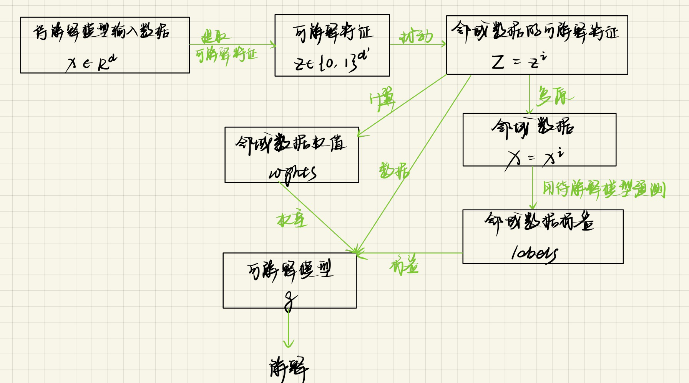
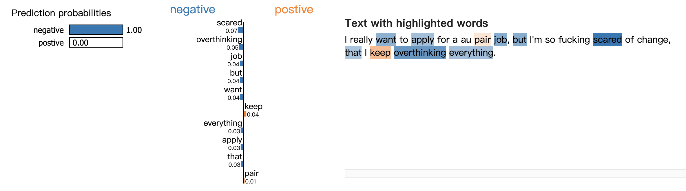
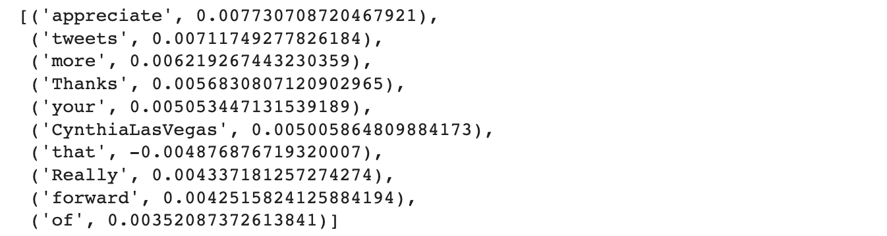
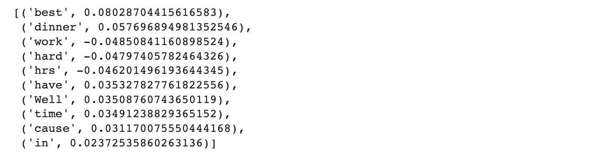
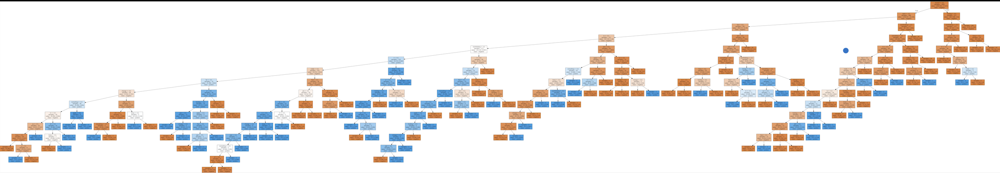

# MSRA大模型可解释研究 结题报告

PB20111718 朱仕哲


## 1. 研究背景和项目目标

### 1.1 研究背景

大模型可解释性研究是一个旨在理解和解释大规模机器学习模型的行为和原理的研究方向。在大模型大规模投入应用的今天，这一研究也越发的重要和有意义。

研究大模型可解释性有如下意义：

- 提高大模型的可信度和透明度，让用户和开发者能够了解模型的内部机制，判断模型作出判断的可靠性和合理性。
- 发现大模型的优势和局限，分析模型的性能和泛化能力，找出模型的优化方向和可改进空间。
- 挖掘大模型的潜在价值，利用模型的中间输出和隐含知识，提取有用的信息和洞察，支持决策和创新。
- 保障大模型的安全和公平，检测和消除模型的偏差和漏洞，防止模型的滥用和误用，保护用户的利益和权益。


### 1.2 项目目标

本项目的目标如下：

- 对可解释方法LIME相关文献的调研和总结
- 基于Sentiment140数据集，对预训练语言模型BERT base进行fine-tune，然后使用LIME官方代码生成解释
- 用自己实现的LIME生成该模型的解释，并给出生成解释的例子(case study)，与官方结果比较
- 总结用LIME分析BERT你得到了什么insight，比如BERT是否用到正确的信息进行预测，可解释方法的优点或不足
- 对BERT base或者LIME可能改进方法的思考，以及对未来可能研究方向的展望(可选)


## 2. 模型可解释研究相关文献调研

### 2.1 LIME 方法

*“Why Should I Trust You?” Explaining the Predictions of Any Classifier*

- **概述：**

  在这篇文章中，作者将使用者对模型的信任划分为两个层次：

  1. *trusting a prediction*, i.e. whether a user trusts an individual prediction sufficiently to take some action based on it
  2. *trusting a model*, i.e. whether the user trusts a model to behave in reasonable ways if deployed

  对于这两个层次，作者分别提出了LIME 和 SP-LIME （submodule pick）两种方法来对模型进行解释：

  1. *LIME：*

     LOCAL INTERPRETABLE MODEL-AGNOSTIC EXPLANATIONS，an algorithm that can explain the predictions of any classifier or regressor in a faithful way, by approximating it locally with an interpretable model.

  2. *SP-LIME：*

     A method that selects a set of representative instances with explanations to address the “trusting the model” problem, via submodular optimization.

  另外，文章还提到了一个好的解释器应该具有的特点：

  1. *Interpretable：*

     i.e., provide qualitative understanding between the input variables and the response. We note that interpretability must be easy to understand. For example, a explainer shouldn't provide hundreds or thousands of features significantly contribute to a prediction, and a small number of weighted features as an explanation will be better than a Bayesian network.

     

  2. *Local fidelity:*

     For an explanation to be meaningful it must at least be locally faithful, i.e. it must correspond to how the model behaves in the vicinity of the instance being predicted.

  3. *Model-agnostic:*

     Treat the original model as a black box. Can explain any model.

     

- **算法**：

  LIME算法的主要思想是：使用可解释特征训练一个可解释模型，在特定样本的局部线性邻域内拟合待解释模型。

  

  算法的具体步骤如下：

  - 提取可解释特征：如text classifier 以text作为输入，可以将词袋作为提取出的可解释特征；image classifeir 以图片作为输入，可以提取超像素（a contiguous patch of similar pixels）作为可解释特征。
  - 数据扰动：对提取出来的可解释特征做扰动，生成一组邻域数据的可解释特征，并由其到原始特征的距离计算权重。
  - 待解释模型预测：将扰动后的可解释特征复原成原始数据，使用待解释模型进行预测，的到标签。
  - 使用领域数据的可解释特征作为数据，领域数据标签作为标签，训练一个可解释模型（线性模型，决策树模型，falling rule list模型等，本文使用了线性模型），得到这个模型的解释，来作为待解释模型在这个instance局部的解释。

  


*Explaining the Explainer: A First Theoretical Analysis of LIME*

- **概述：**
  - 文章对LIME算法进行了理论分析，推导了当被解释的函数是线性的时候，LIME生成的可解释模型的系数的闭式表达式。结果表明，这些系数与被解释函数的梯度成正比，说明LIME 确实发现了有意义的特征。
  - 文章也揭示了LIME中参数选择不当可能导致LIME忽略重要特征的问题。


*What does LIME really see in images?*

- **概述：**
  - 文章对LIME算法在图像解释中的表现进行了理论分析，证明了当生成的样本数量足够大时，LIME生成的解释会收敛到一个极限解释，且给出了该极限解释的显式表达式。
  - 本文进一步对基本形状检测器和线性模型进行了研究。通过这些分析，本文发现了LIME和另一种解释方法——积分梯度之间的联系。更具体地说，LIME生成的解释与在LIME预处理步骤中使用的超像素上的积分梯度之和和是相似的。


*ALIME: Autoencoder Based Approach for Local Interpretability*

- **概述：**

  提出了基于LIME的ALIME 方法，其基本思想是：

  - 利用自编码器对输入样本进行编码和解码，得到重构后的样本。
  - 利用LIME算法对原始样本和重构样本进行局部解释，生成一些可解释的特征和权重。
  - 利用自编码器的编码层作为一个权重函数，对LIME生成的特征和权重进行调整，得到更稳定和更准确的解释。

  相较于LIME，ALIME方法有以下优势：

  - 可以克服LIME算法中随机生成数据集导致的解释不稳定的问题。
  - 可以利用自编码器的非线性特性提高解释的质量和精度。


### 2.2 CAM 方法

Learning Deep Features for Discriminative Localization

Grad-CAM: Visual Explanations from Deep Networks via Gradient-based Localization

- **概述**

  CAM（class activation mapping）是一种特征可视化技术，它可以将卷积神经网络在分类时使用的分类依据（图中对应的类别特征）在原图的位置进行可视化，并绘制成热图，以此来展示模型的分类依据。

  

- **算法**

  - *CAM算法：*

  

  - *Grad-CAM算法：*

  

  

## 3. 实验过程

### 3.0 实验环境

本实验的实验环境为Google Colab 以及 Pycharm。代码源码上传在我的github 仓库：https://github.com/icarushhh/MSRA-myLime.git


### 3.1 fine-tune BERT base

在这一小节，主要使用Sentiment140数据集一个子集（助教提供），对预训练语言模型bert_base_uncased进行fine-tune。以ipython notebook的形式在Colab上运行。这一节没有贴源码（过于冗长），源码上传在了github仓库，这里只做简单介绍。

训练代码参考了文章 *BERT Fine-Tuning Tutorial with PyTorch*

主要过程如下：

- **训练数据处理：**

  读取sentiment140_train_data.csv，用其中的text 和label 的值构建训练数据，其中text 需要使用transformers.BertTokenizer 进行处理，使其符合BERT的输入形式

- **预训练模型准备：**

  使用hugging face transformer 库提供的预训练BERT模型

  ```python
  from transformers import BertForSequenceClassification, AdamW, BertConfig
  
  # 加载 BertForSequenceClassification, 预训练 BERT 模型 + 顶层的线性分类层 
  model = BertForSequenceClassification.from_pretrained(
      "bert-base-uncased", # 小写的 12 层预训练模型
      num_labels = 2, # 分类数 --2 表示二分类
                      # 可以改变这个数字，用于多分类任务  
      output_attentions = False, # 模型是否返回 attentions weights.
      output_hidden_states = False, # 模型是否返回所有隐层状态.
  )
  
  optimizer = AdamW(model.parameters(),
                    lr = 2e-5, # args.learning_rate - default is 5e-5
                    eps = 1e-8 # args.adam_epsilon  - default is 1e-8
                  )
  
  # 训练 epochs。 BERT 作者建议在 2 和 4 之间，设大了容易过拟合 
  epochs = 4
  ```

- **fine-tune 预训练模型：**每轮训练的信息如下

  


随着训练轮数增加，训练集的loss 不断减小，验证集的loss 不断增大。验证集的准确率在0.85附近，说明模型的训练效果良好。


### 3.2 使用LIME官方代码对模型生成解释

在这一小节，主要使用官方实现的lime包对fine-tune后的BERT模型进行可解释性分析，同样在Colab中以ipython notebook方式运行。


#### 3.2.1 加载fine-tune后的模型

```python
!pip install lime
!pip install transformers
!pip install torch

import torch
device = torch.device('cuda' if torch.cuda.is_available() else 'cpu')

# 挂载 Google Drive
from google.colab import drive
drive.mount('/content/drive')
from transformers import BertForSequenceClassification
from transformers import BertTokenizer

# 加载模型和分词器
dir = '/content/drive/MyDrive/Bert_Finetune/Bert fine-tuned on a subset of sentiment140/model_save'
model = BertForSequenceClassification.from_pretrained(dir)
tokenizer = BertTokenizer.from_pretrained(dir)
class_names = ['negative','postive']
```


#### 3.2.2 使用lime包对模型的预测生成解释

```python
import numpy as np
import lime
import torch
import torch.nn.functional as F
from lime.lime_text import LimeTextExplainer

# from transformers import AutoTokenizer, AutoModelForSequenceClassification

# tokenizer = AutoTokenizer.from_pretrained("ProsusAI/finbert")
# model = AutoModelForSequenceClassification.from_pretrained("ProsusAI/finbert")
# class_names = ['positive','negative', 'neutral']

def predictor(texts):
  outputs = model(**tokenizer(texts, return_tensors="pt", padding=True))
  probas = F.softmax(outputs.logits).detach().numpy()
  return probas

explainer = LimeTextExplainer(class_names=class_names)

str_to_predict = "I really want to apply for a au pair job, but I'm so fucking scared of change, that I keep overthinking everything."
exp = explainer.explain_instance(str_to_predict, predictor, num_features=10, num_samples=1000)

exp.as_list()
```

> Output:
>
> 

```python
exp.show_in_notebook(text=str_to_predict)
```

> Output:
>
> 

**首先来看一个negative的case。**在这一个case中，可以发现lime的解释较为准确。其中系数绝对值最大的四个feature为“scared”，“overthinking”, "job"和“but”，且系数为负数，表示对这些words 促进模型判断这个string 为negative，这也与我们的常识相符合。说明在这个例子中，模型的判断依据较为准确和可解释。

**接下来是另一个positive的case：**

```python
str_to_predict = "@CynthiaLasVegas   Thanks so much!!! Really appreciate that...Look forward to more of your tweets!!!!!!!!"
exp = explainer.explain_instance(str_to_predict, predictor, num_features=10, num_samples=1000)

exp.as_list()
```

> Output:
>
> 

```python
exp.show_in_notebook(text=str_to_predict)
```

> Output:
>
> 

在这一个例子中，虽然模型的预测结果是准确的，但是根据lime的解释，模型的判断依据并不完全准确。可以发现“tweets” 这个word的系数绝对值第二大，对model判定这段text为postive有促进作用，但事实上这应该是一个中性词。另外，BERT还将“that”，“your” ，“of” 和用户id “CynthiaLasVegas” 等词纳入判断依据，这也不太合理。

**最后看一个半句postive，半句negative 的case：**

```python
str_to_predict = "just got home from dinner  best dinner i have had in a long time! Well I probably should get ready for bed cause i have 15 hrs hard work tomorrow =("
exp = explainer.explain_instance(str_to_predict, predictor, num_features=10, num_samples=1000)

exp.as_list()
```

> Output:
>
> 

```python
exp.show_in_notebook(text=str_to_predict)
```

> Output:
>
> 

在这一个case中，模型同样作出了和label一致的判断（positive），但是根据lime的解释，模型的判断依据并不是很可信。比如“cause”，“in”，“had”，“have”，“hrs”，“just”等没有明显感情倾向的word被用作判断依据，而“hard” 这个词应该对模型判断其为negative起促进作用，但模型对他的考虑权重并不大。

当然也是因为这个句子中适合作为判断依据的词较少，故前十个feature中会有很多无关词。“in”，“had”，“have”，“hrs”，“just”等无关词的权重绝对值都排在后五位。

**最后，我使用SP-lime试图对整个模型生成解释：**

根据lime作者在github的issure(https://github.com/marcotcr/lime/issues/617)里的解释，“sp_obj.sp_explanations will give you a list of explanations for inspection, which should contain diverse explanations with important features. It does not give you a ranked list of feature importances.” 也就是说SP-lime的结果并不是给出对模型影响最大feature，而只是生成一个能较全面地覆盖模型的explaination。

```python
from lime import submodular_pick

sp_explainer = submodular_pick.SubmodularPick(explainer, sentences, predictor, sample_size=5, num_features=6, num_exps_desired=2)
```

但是效果并不理想。原因是当我使用大小为2000的数据集，设置sample_size为20，num_features = 10时平台的系统RAM（85G）溢出了。最后只能使用大小1000的数据集，sample_size = 5, num_features = 6。

得到结果如下：


在SP-lime的解释中，可以发现“cried”，“puked”是较好的判断依据，但“you”，“I”，“totally”和“until“则是不那么好的判断依据。说明我们fine-tune后的BERT模型能选择一些正确的且较为有效的判断依据，但也有很多依据是不合理的。


### 3.3 自己实现LIME并对模型生成解释

在这一小节，主要根据LIME论文中介绍的实现原理和github官方的代码来实现一个自己的lime，并使用自己实现的lime对fine-tune后的BERT模型生成解释，与官方结果进行比较。


#### 3.3.1 自己实现LIME

**我实现的LIME的结构如下：**

- **myTextExplainer.py:** 

  - *`class SplitedString():`* 

    对输入的text作预处理。将text中的word作分割，存储在word_list中，并创建text的单词表vocab，vocab中的每一个word都是text一个feature，用于后续作扰动和解释。

  - *`class DataPerturber():`* 

    输入splited_string, num_of_samples, predictor，将splited_string 的vocab 表示为词袋后作随机扰动，并将扰动后的词袋复原为string后喂给模型，得到扰动数据的标签。

  - *`class TextExplainer():`*

    调用SplitedString，DataPerturber和my_lime，提供explain_string_by_mylime 和 explain_string_by_treelime的接口。

- **my_lime.py:** 

  - *`explain_instance_linear():`*

    输入扰动后的neighborhood_data, neighborhood_label 和distance，训练一个可解释的线性模型，选择系数较大的几个feature，返回它们的系数。

  - *`explain_string_by_treelime():`*

    输入扰动后的neighborhood_data, neighborhood_label 和distance，训练一个可解释的决策树模型，返回这个决策树模型，其中包含了决策路径，feature_importances等信息

  

**部分源代码如下：（完整代码见github repo）**

- **myTextExplainer.py:** 

  ```python
  class SplitedString(object):
      """1. split raw string into array of words
      2. create a vocabulary and each words' position in the string
      3. offer a method to remove certain word in the string
      """
  
      def __init__(self, raw_string):
          self.raw_string = raw_string
  
          split_expression = r'\W+'
          splitter = re.compile(r'(%s)|$' % split_expression)
          self.word_list = [s for s in splitter.split(self.raw_string) if s]
          # word_list  是一个list，保存分割后的word，包括标点和空格
  
          self.word_list_without_splitter = list(filter(None, re.split(split_expression, 																																							self.raw_string)))
          self.vocab = []
          self.position = []
          # self.vocab 是单词表，nonredundant
          # self.position 保存vocab 中对应单词在word_list 的位置
          
          for i, word in enumerate(self.word_list):
              if word in self.word_list_without_splitter:
                  if word not in self.vocab:
                      self.vocab.append(word)
                      self.position.append([i])
                  else:
                      index = self.vocab.index(word)
                      self.position[index].append(i)
  
      def vocab_size(self):
          return len(self.vocab)
  
      def raw_string(self):
          return self.raw_string
  
      def remove_words(self, index_to_remove):
          """input：一个1 x num_of_vocab 的list，其中0表示remove vocab中相应单词
          output：删去单词后的str
          """
          position_to_remove = []
          result_string = ""
          for i, flag in enumerate(index_to_remove):
              if not flag:
                  for p in self.position[i]:
                      position_to_remove.append(p)
  
          for i, word in enumerate(self.word_list):
              if i in position_to_remove:
                  continue
              else:
                  result_string += word
  
          return result_string
  
  class DataPerturber(object):
      """
      数据扰动器，输入:
      splited_string, num_of_samples, predictor
      提供一个perturb函数
      输出:
      neighbor_data：num_of_samples+1 x vocab_size,
      neighbor_labels: num_of_samples+1 x 2,
      distances: 1 x num_of_samples
      """
  
      def __init__(self, splited_string, num_of_samples, predictor):
          self.splited_string = splited_string
          self.num_of_samples = num_of_samples
          self.predictor = predictor
          self.vocab_size = splited_string.vocab_size()
          self.neighbor_wordbags = np.ones(((num_of_samples+1), self.vocab_size))   
          # 受扰动数据词袋，第一维是原数据词袋
          self.neighbor_rawstring = []
          self.neighbor_rawstring.append(splited_string.raw_string)
          self.neighbor_labels = []
  
      def perturbe(self):
  
          def distance_fn(neighbors):
              """距离函数，计算neighbor_data到其第一维（origin_data）的距离，参考lime源码
              """
              return sklearn.metrics.pairwise.pairwise_distances(
                  neighbors, neighbors[0].reshape(1, -1), metric='cosine').ravel() * 100
  
          random.seed(99)         # 设置随机数种子，保证每次扰动结果相同
          perturbe_size = []      # 1 x num_of_samples-1 的数组，
          												# 表示每个受扰动数据扰动word数量（1～vocab_size-1）
          for i in range(self.num_of_samples):
              perturbe_size.append(random.randint(1, self.vocab_size - 1))
  
          word_indexes = [i for i in range(self.vocab_size)]
  
          for i, size in enumerate(perturbe_size, start=1):
              indexes_samples = random.sample(word_indexes, size)
              self.neighbor_wordbags[i, indexes_samples] = 0
              string_after_removing = self.splited_string.remove_words(
                																					self.neighbor_wordbags[i])
              self.neighbor_rawstring.append(string_after_removing)
  
          self.neighbor_labels = self.predictor(self.neighbor_rawstring)
          distances = distance_fn(self.neighbor_wordbags)
  
          return self.neighbor_wordbags, self.neighbor_labels, distances
  
  class TextExplainer(object):
  
      def __init__(self,
                   kernel_width=25,
                   class_names=None,
                   feature_selection='auto',):
  
          def kernel(d):
              """kernel_fn: function that transforms an array of distances into an
              array of proximity values (floats).
              """
              return np.sqrt(np.exp(-(d ** 2) / kernel_width ** 2))
  
          self.kernel_fn = kernel
  
  
          self.class_names = class_names
          self.feature_selection = feature_selection
  
      def explain_string_by_mylime(self, raw_string, predictor, num_features=10, 																									num_samples=5000):
          """ explain a single string by my lime
          """
          self.splited_string = SplitedString(raw_string)
          perturber = DataPerturber(self.splited_string, num_samples, predictor)
          (neighbors, neighbor_labels, distance) = perturber.perturbe()
  
          base = my_lime.MyLime(self.kernel_fn)
          (self.list, predict_score, local_predict) = base.explain_instance_with_data(neighbors, 																		neighbor_labels, distance, label=1,                             										 						   num_features=num_features,
                                     feature_selection=self.feature_selection)
  
          return
  
      def show_as_list(self):
        	""" show lime explaination with a list of features and weights
        	"""
          vocab = self.splited_string.vocab
          words = []
          coef = []
          for x in self.list:
              words.append(vocab[x[0]])
              coef.append(x[1])
  
          output = sorted(zip(words, coef),
                         key=lambda x: np.abs(x[1]), reverse=True)
  
          print(output)
          return
        
        
      def explain_string_by_treelime(self, raw_string, predictor, 																																 num_features = 10, num_samples=5000, max_depth=5):
          """
          using lime with decision tree to explain
          """
          self.num_features = num_features
          self.splited_string = SplitedString(raw_string)
          perturber = DataPerturber(self.splited_string, num_samples, predictor)
          (neighbors, neighbor_labels, distance) = perturber.perturbe()
  
          base = my_lime.MyLime(self.kernel_fn)
  
          self.tree_model = base.explain_instance_tree(neighbors, neighbor_labels, distance
                                                       max_depth)
  
          return
  
        
      def show_tree(self):
          dot_data = export_graphviz(self.tree_model, out_file=None,
                                      feature_names= self.splited_string.vocab,
                                      class_names=self.class_names,
                                      filled=True, impurity=False)
          graph = graphviz.Source(dot_data, format="png")
          graph.render('text/tree_model')
  
          plot_tree(self.tree_model)
  
          self.importances = sorted(zip(self.splited_string.vocab, 																										    					  self.tree_model.feature_importances_),
                  key=lambda x: np.abs(x[1]), reverse=True)
          self.importances = self.importances[:self.num_features]
  
          print(self.importances)
          return
  ```

- **my_lime.py:** 

  在my_lime中，我尝试使用了多种线性模型和决策树模型：

  - *sklearn.LinerRegression():*  

    最基本的线性回归函数，使用最小二乘法来拟合一个线性模型，不加入任何惩罚项。

  - *Ridge():*  

    岭回归模型，是一种线性回归模型，使用L2正则化来控制模型的复杂度，防止过拟合。它的目标函数是最小化平方误差和正则化项的和。LIME的官方实现就是使用这一种线性模型。

  - *Lasso():*  

    一种使用L1范数作为惩罚项的线性回归函数，它可以使得一些系数变为0，从而实现特征选择。

    但我尝试在my_lime中使用Lasso作为线性模型时，总是出现所有feature的系数均为0的情况，我尝试了使用不同的参数$\alpha$, 也没法解决问题。

  - *ElasticNet():*  

    一种使用L1和L2范数作为惩罚项的线性回归函数，它可以结合Lasso和Ridge的优点，既可以实现特征选择，又可以防止过拟合。

    在my_lime中使用ElasticNet作为线性模型时，也会遇到Lssso相同的问题。

  - *DecisionTreeClassifier():* 

    决策树分类模型，是一种非线性分类模型，使用树结构来划分特征空间，根据不同的划分准则来选择最优的分裂点。

    

  另外，代码实现中的feature_selection()函数我参考了lime源码。

  ```python
  class MyLime(object):
  
      def __init__(self, kernel_fn, random_state=None):
          self.kernel_fn = kernel_fn
          self.random_state = check_random_state(random_state)
              
      def explain_instance_linear(self, neighbor_wordbags, neighbor_labels, 
      															 distances, label = 1, num_features = 5, 
      															 feature_selection='auto'):
          weights = self.kernel_fn(distances)
          self.labels_column = neighbor_labels[:, label]
          used_features = self.feature_selection(neighbor_wordbags,
                                                 self.labels_column,
                                                 weights,
                                                 num_features,
                                                 feature_selection)
  				
          # 尝试使用多种可解释线性模型
          easy_model = LinearRegression(fit_intercept=True)
          # easy_model = Ridge(alpha=1, fit_intercept=True, random_state=self.random_state)
          # easy_model = Lasso(alpha=0.02, fit_intercept=True, random_state=self.random_state)
          # easy_model = ElasticNet(alpha=0.02, fit_intercept=True, 			     																								 	   random_state=self.random_state)
  
          easy_model.fit(neighbor_wordbags[:, used_features],
                         self.labels_column, sample_weight=weights)
          prediction_score = easy_model.score(
              neighbor_wordbags[:, used_features],
              self.labels_column, sample_weight=weights)
  
          local_pred = easy_model.predict(neighbor_wordbags[0, used_features].reshape(1, -1))
  
          return (sorted(zip(used_features, easy_model.coef_),
                         key=lambda x: np.abs(x[1]), reverse=True),
                  prediction_score, local_pred)
          
      def explain_instance_tree(self, neighbor_wordbags, neighbor_labels, distances,
                                max_depth=5):
          """
          explain a text with decision tree
          """
  
          weights = self.kernel_fn(distances)
  
          self.binary_labels = []
          for label in neighbor_labels:
              self.binary_labels.append(1 if label[1] > label[0] else 0)
  
          tree_model = DecisionTreeClassifier(random_state=0, max_depth=max_depth)
          tree_model.fit(neighbor_wordbags, self.binary_labels, sample_weight=weights)
  
          return tree_model
  ```


#### 3.3.2 用自己实现的LIME对模型生成解释，并与官方结果进行比较

在这一小节，我先使用`my_lime.explain_instance_linear()` 对3.2.2小节中使用lime解释的三个case生成解释，并与3.2.2小节中的结果做比较。

接着，我使用`my_lime.explain_instance_tree()`对第一个case进行解释，来说明如何通过决策树来获取模型的可解释信息。

**线性模型：**

- **Case1:** 

  ```python
  from transformers import BertForSequenceClassification
  from transformers import BertTokenizer
  
  # 加载模型和分词器
  dir = '/content/drive/MyDrive/Bert_Finetune/Bert fine-tuned on a subset of sentiment140/model_save'
  model = BertForSequenceClassification.from_pretrained(dir)
  tokenizer = BertTokenizer.from_pretrained(dir)
  class_names = ['negative','postive']
  
  import my_lime
  import myTextExplainer
  
  import numpy as np
  import torch
  import torch.nn.functional as F
  from myTextExplainer import *
  
  def predictor(texts):
    outputs = model(**tokenizer(texts, return_tensors="pt", padding=True))
    probas = F.softmax(outputs.logits).detach().numpy()
    return probas
  
  string = "I really want to apply for a au pair job, but I'm so fucking scared of change, that I keep overthinking everything."
  
  explainer = TextExplainer()
  explainer.explain_string_by_mylime(string, predictor, num_features=10, num_samples=1000)
  explainer.show_as_list()
  ```

  > Output:
  >
  > 

与官方结果比较：


比较后可以发现：

1. 两者权重排名前十的features中有三个不同，my_lime中是['to', 'fucking', 'so'], 而lime中则是['apply', 'that', 'pair'], 这些词大多都是中性词，但是my_lime多发现了一个‘fucking’，这个词可能会被BERT用作判定结果为negative的依据。

2. 同一个feature在两者中的权值和排序略有区别，但是正负关系是一致的。
3. my_lime 的权值大小差距相对较大些，这可能与不同线性模型的特性有关。


- **Case2:**

  ```python
  string = "@CynthiaLasVegas   Thanks so much!!! Really appreciate that...Look forward to more of your tweets!!!!!!!!"
  explainer.explain_string_by_mylime(string, predictor, num_features=10, num_samples=1000)
  
  explainer.show_as_list()
  ```

  > Output:
  >
  > 

  官方结果：

  

  比较可发现：

  1. 两者权重排名前十的features中只有一个不同。my_lime中的“much” 和lime中的“of”

  2. 同一个feature在两者中的权值和排序略有区别，但是正负关系是一致的。

  

- **Case3:** 

  ```python
  string = "just got home from dinner  best dinner i have had in a long time! Well I probably should get ready for bed cause i have 15 hrs hard work tomorrow =("
  explainer.explain_string_by_mylime(string, predictor, num_features=10, num_samples=1000)
  
  explainer.show_as_list()
  ```

  > Output:
  >
  > 

官方结果：


比较发现：

1. 在这个case中my_lime 的表现要优于lime，原因是它多发现了“hard”，“well”两个词，它们更有可能被BERT用作判断的依据。
2. 其他无关词较多，应该是因为这段text中适合作为判断依据的word不到十个。


**决策树模型：**

- **Case1:**

  ```python
  string = "I really want to apply for a au pair job, but I'm so fucking scared of change, that I keep overthinking everything."
  
  explainer.explain_string_by_treelime(string, predictor, num_features=10, num_samples=1000
                                       max_depth=20)
  explainer.show_tree()
  ```

  > Output:
  >
  > (feature_importances)
  >
  > 
  >
  > (Decision tree)
  >
  > 

- 与线性模型不同，这里的list表示feature_importances, 是由这一feature在决策过程中的重要性决定的。通过feature_importances 我们也能够看出各个word 对BERT模型作出判断的重要程度，以达到解释模型的目的。

- 同时，我们还可以通过决策树的决策过程来获取可解释信息：（由于决策树过大，在这里截取部分分支来说明）


例如，在这个分支中，左边的分支表示True，即条件overthinking = 0成立，也即text中没有’overthinking‘这个词，反之，右边的分支则表示’overthinking‘这个词存在于text中。而节点的颜色代表预测结果，橙色越深则越可能是negative，蓝色越深则越有可能是positive。可以看到，若’overthinking‘不存在，则决策树走向左侧分支，模型的预测结果由negative转变为positive；而若’overthinking‘存在，则决策树走向右侧分支，模型预测结果为negative的可能性加大。这说明‘overthinking’ 这个词会推动模型的预测偏向negative。

由此，我们便可以通过分析决策树来获取模型的可解释信息。决策树提供的信息可能更多，但是并没有线性模型那样直观。


## 4. Insights

- **BERT 是否用到了正确的信息进行预测：**

  我们可以根据LIME 给出的解释中影响系数绝对值靠前的那些feature（word）来判断BERT 是否用到了正确的信息进行预测。

  总结LIME 解释的三个case我们可以发现，LIME 给出的解释中系数绝对值排名前五的feature 基本都是有效信息。虽然前十个feature中会出现一些无关词，但大多数是因为我们的test case较短，其中可用于做预测的信息比较少，所以前十个feature里必然会出现其他无关词，并不能由此就说模型的可解释性差。

  

- **BERT 对于每个可解释特征的理解是否正确**：

  我们通过LIME 给出的解释中某一个有效feature（即无关词除外）系数的正负是否和我们的直观判断相符来判断BERT 对于每个可解释特征的理解是否正确。

  总结LIME 解释的三个case我们发现，BERT 没有在某个单词的影响系数的正负上出现错误。比如，BERT 不会将人类常识中倾向于negative的词用作预测结果为positive的依据，反之也不会将倾向于positive 的词用作预测结果为negative 的依据。说明BERT 能够正确学习到这些单词的情感倾向，能够正确的理解这些可解释特征。

  

- **LIME 可解释方法的优点：**

  - LIME是一种模型无关的方法，可以适用于任何类型和结构的模型，包括BERT等复杂的深度学习模型，泛化性很强。

  - LIME是一种局部的方法，可以针对每个样本生成个性化的局部解释，而不是一个全局的统计量。

  - LIME是一种基于采样和扰动的方法，可以在不改变原始数据和模型的情况下生成解释。

    

- **LIME 可解释方法的不足：**

  - LIME需要设计合适的可解释特征和采样样本相似度度量（即权重计算），这可能与BERT 原来使用的特征不同，导致解释与真实情况不一致。
  - LIME需要选择合适的超参数和可解释模型，这可能会解释的质量和稳定性。
  - LIME的运行时需要大量的采样和扰动，这可能导致计算效率低下和资源消耗大。比如在较大数据集上运行SP-lime时便发生RAM 溢出的状况。
  - LIME只能提供局部的解释，不能反映BERT在整体上学习到了什么模式和规律。
  - LIME不能保证与原始模型在全局范围内的一致性，即对不同样本生成的解释可能存在矛盾或冲突。


## 5. Ideas

在完成了这个项目后，我也对如何改进BERT 模型和如何生成更好的解释产生了一些想法。这些想法可能并不成熟，希望老师和助教指正。

- **对模型输入作预处理：**

  在使用LIME对BERT 微调后生成的分类器进行可解释分析时发现，有很多代词、连词等无关词被模型当作预测的依据，这也使模型的可解释性变差。

  基于这个事实，在我们对模型进行训练或fine-tune时，或许可以对训练数据作一些task-specific 的处理，比如在情感分类任务中，我们可以人为地将原始数据中的这些无关词，如“I”，“your”，“that”等词过滤掉，不让模型基于这些无关词作出判断。这样或许可以让模型作出可解释性更好的预测。

- **在LIME算法中，改进可解释特征的选择：**

  在LIME 官方代码中，LIME使用unigram 的词袋模型作为一段text 的可解释特征，即解释单个单词对于待解释模型如何作出预测的影响。而我们的模型作为一个黑盒，不一定是依据单个单词来作出的判断，也有可能是根据单词的组合方式、词组等其他因素作出的判断。因此仅使用unigram 的词袋模型可能不能很好的解释模型，我们或许可以尝试其他的可解释特征，比如bigram，n-gram的词袋等。

  这也比较符合我们人类对句子作出情感分析的直觉：比如“not bad” 这个词组，“not” 和 “bad” 单个词会被预测为negative， 但连起来却应该预测为positive；又如“looking forward to”这个词组，单个单词可能都不存在感情倾向，但连起来便会倾向于postive。

- **在LIME算法中，尝试使用改进可解释模型的选择：**

  在LIME 的论文中也提到，如果待解释模型即使在某一个prediction的邻域内也非常的不线性，那么使用liner model 来解释这个模型就不能得到正确的解释。因此，不同的待解释模型可能需要使用不同的简单模型来进行局部拟合和解释。

  如果我们能够根据不同待解释模型的特性，来针对性的选择task-specific 的可解释模型来构建LIME，或许能够使生成的解释更加贴合原模型。

  

  

  

